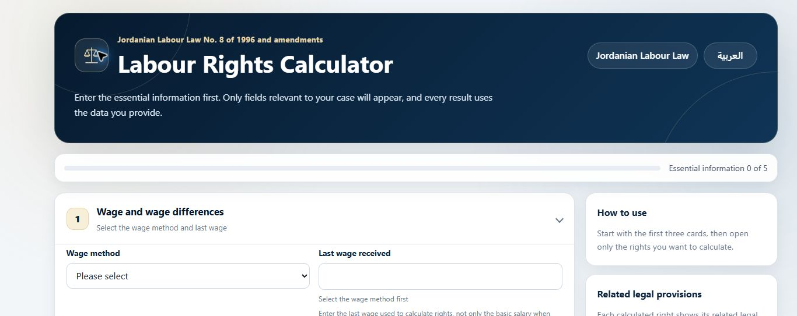

<div dir="rtl">

# حاسبة الحقوق العمالية الأردنية

حاسبة ثنائية اللغة لحساب مجموعة من الحقوق العمالية بصورة استرشادية وفق قانون العمل الأردني رقم 8 لسنة 1996 وتعديلاته. صُممت لتعمل مباشرة في المتصفح بواجهة عربية من اليمين إلى اليسار، وواجهة إنجليزية كاملة، ومن دون حساب مستخدم أو إرسال البيانات إلى خادم.

[فتح الحاسبة المنشورة](https://jordanian-labour-rights-calculator.netlify.app/)


## المزايا

- حساب الأجور غير المدفوعة وفرق الأجور.
- احتساب بدل الإشعار في الحالة التي يدعمها التطبيق.
- تقدير استرشادي لبدل الفصل التعسفي.
- احتساب المدة المتبقية من العقد المحدد المدة.
- احتساب مكافأة نهاية الخدمة بحسب حالة الاشتراك في الضمان الاجتماعي.
- احتساب بدل الإجازات السنوية عن آخر سنتين.
- احتساب العمل الإضافي والعمل في العطل الرسمية والراحة الأسبوعية.
- احتساب الرواتب السنوية الإضافية بحسب الأشهر المستحقة.
- إضافة صافي مستحقات صناديق الادخار أو التوفير أو التقاعد.
- دقة مالية حتى ثلاثة منازل عشرية.
- تنبيه غير مانع عند إدخال أجر يقل عن الحد الأدنى العام الحالي.
- إظهار المواد القانونية المرتبطة بالنتيجة.
- رابط مباشر إلى صفحة القوانين الرسمية في وزارة العمل الأردنية.
- تصميم متجاوب مع الحاسوب والهاتف والطباعة.
- معالجة محلية للبيانات داخل المتصفح.

## صور من نسخة الحاسوب

### الواجهة الإنجليزية



### مثال للنتائج


## التشغيل محليًا

يمكن فتح ملف الصفحة الرئيسية مباشرة، أو تشغيل خادم محلي بسيط:

```powershell
python -m http.server 8000
```

ثم افتح:

```text
http://localhost:8000
```

## الاختبارات

يمكن تشغيلها جميعًا بأمر واحد:

```powershell
npm test
```

أو تشغيل كل ملف على حدة:

```powershell
node tests/calculator-engine.test.js
node tests/calculator-comprehensive.test.js
node tests/ui-structure.test.js
```

## المصادر القانونية

راجع ملف [المصادر القانونية](LEGAL_SOURCES.md) وصفحة [القوانين الرسمية في وزارة العمل الأردنية](https://www.mol.gov.jo/AR/List/%D8%A7%D9%84%D9%82%D9%88%D8%A7%D9%86%D9%8A%D9%86).

## التنبيه القانوني

هذه الحاسبة أداة إرشادية غير ملزمة، وتعتمد نتائجها على صحة البيانات والخيارات التي يدخلها المستخدم. لا تحسم الوقائع المتنازع عليها، ولا تثبت الفصل التعسفي، ولا تغني عن الاستشارة القانونية المتخصصة.

## الخصوصية

تُجرى الحسابات محليًا داخل المتصفح، ولا يجمع المشروع البيانات المدخلة ولا يرسلها إلى خادم.

## المؤلف

المحامي محمد الشوحه

## الرخصة

المشروع منشور بموجب [رخصة إم آي تي](LICENSE).

</div>

---

# Jordanian Labour Rights Calculator

A bilingual, browser-based calculator that provides indicative calculations for selected employment rights under Jordanian Labour Law No. 8 of 1996 and its amendments. It includes a complete Arabic right-to-left interface and an English interface, requires no user account, and performs calculations locally in the browser.

[Open the live calculator](https://jordanian-labour-rights-calculator.netlify.app/)


## Features

- Unpaid wage and wage-difference calculations.
- Notice compensation for the supported scenario.
- Indicative arbitrary-dismissal compensation.
- Remaining fixed-term contract compensation.
- End-of-service benefit based on social-security status.
- Annual-leave allowance for the last two years.
- Overtime, official-holiday and weekly-rest work calculations.
- Prorated additional annual salaries.
- Savings, provident, pension or similar fund entitlements.
- Three-decimal monetary precision.
- A non-blocking current minimum-wage notice.
- Related legal provisions shown with calculated results.
- Direct access to the official Jordanian Ministry of Labour laws page.
- Responsive desktop, mobile and print layouts.
- Local, private processing of entered data.

## Desktop screenshots

### English interface


### Results example


## Run locally

Open the main page directly or start a simple local server:

```powershell
python -m http.server 8000
```

Then open:

```text
http://localhost:8000
```

## Tests

Run the complete suite:

```powershell
npm test
```

Or run each file separately:

```powershell
node tests/calculator-engine.test.js
node tests/calculator-comprehensive.test.js
node tests/ui-structure.test.js
```

## Legal sources

See [Legal sources](LEGAL_SOURCES.md) and the [official Jordanian Ministry of Labour laws page](https://www.mol.gov.jo/AR/List/%D8%A7%D9%84%D9%82%D9%88%D8%A7%D9%86%D9%8A%D9%86).

## Legal notice

This is a non-binding guidance tool. Results depend on the accuracy of the information and options entered. The calculator does not determine disputed facts, establish arbitrary dismissal, or replace professional legal advice.

## Privacy

Calculations run locally in the browser. The project does not collect or transmit entered data.

## Author

Attorney Mohammad Al-Shouha

## License

Released under the [MIT License](LICENSE).
